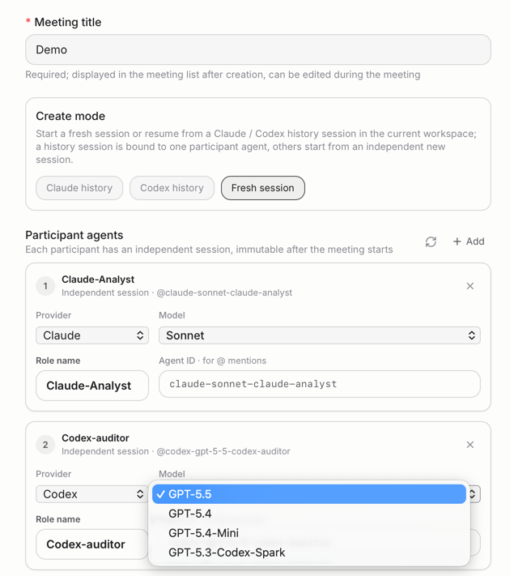
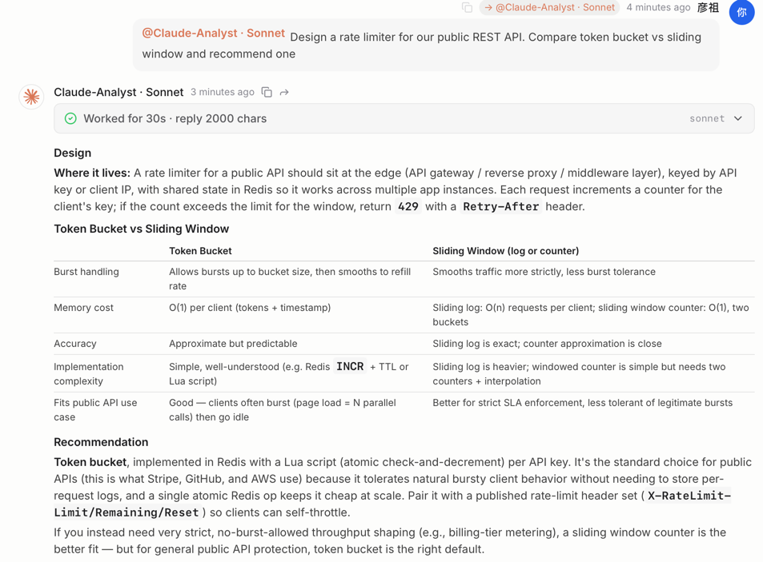
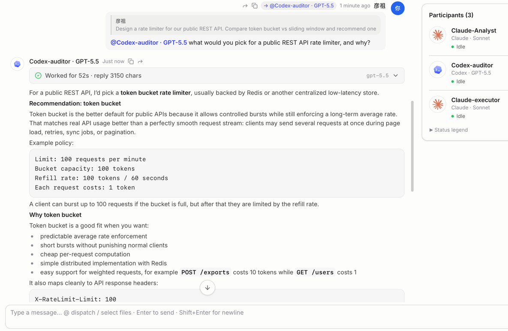
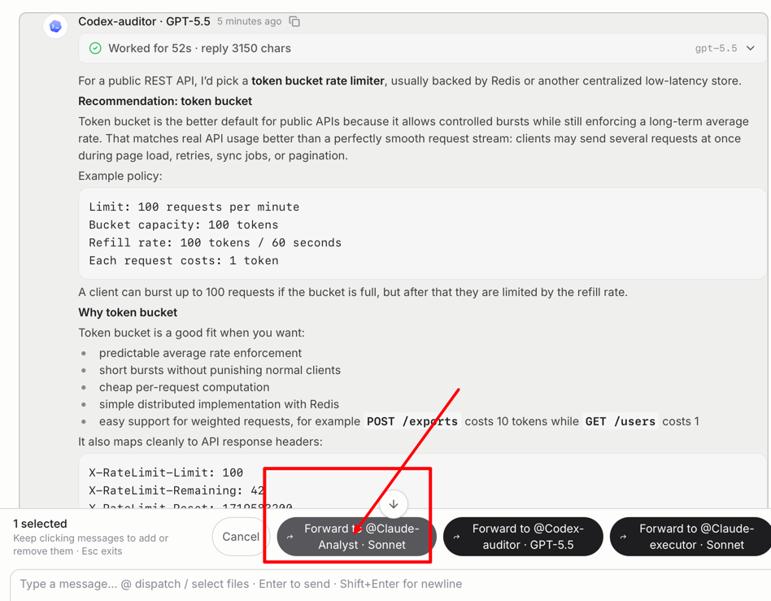
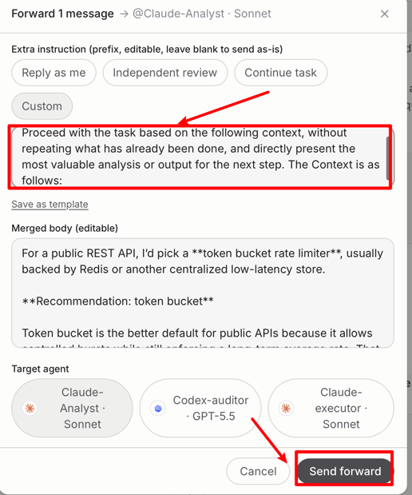
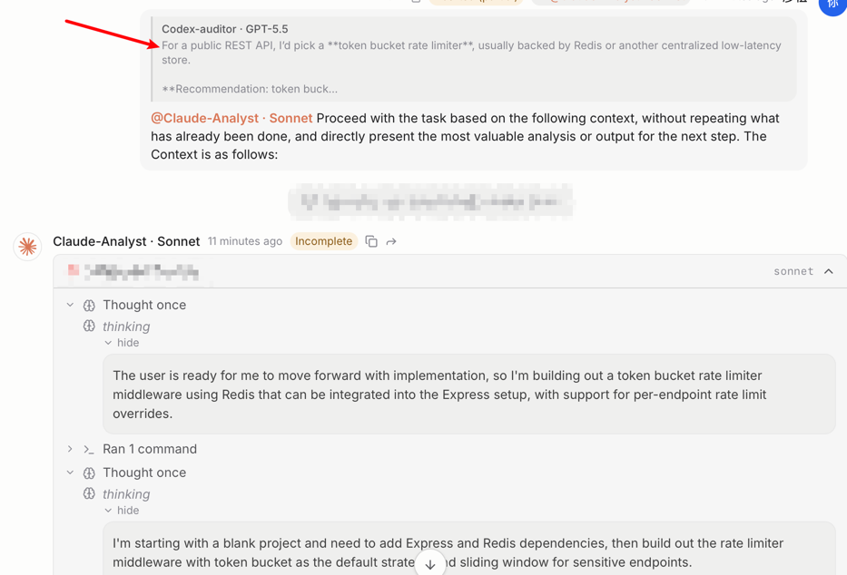
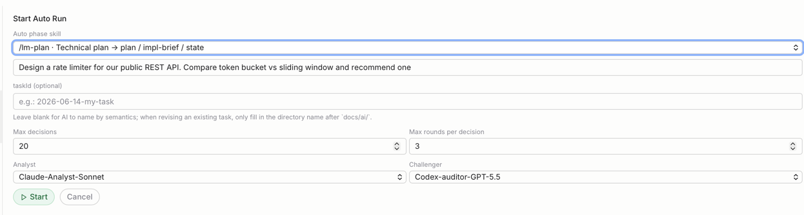

# Atrium Releases / Atrium 发布

Official release downloads for Atrium.

Atrium 官方发布包下载仓库。

This repository only hosts public release materials and downloadable builds for Atrium. The Atrium source code is not published in this repository.

本仓库仅用于托管 Atrium 的公开发布材料和可下载构建包，不包含 Atrium 源代码。

*One room, multiple agents — you direct every handoff. / 一个房间，多个 agent —— 每次交接都由你掌控。*

  

  

  

## Already copy-pasting between AI coding agents? / 还在 AI 编程工具之间手动复制粘贴？

If you already work across several AI coding agents — asking one to analyze, another to change code, another to review — you probably spend a lot of time manually copying questions, answers, and context from one to another, and lose track of where each result came from.

如果你已经同时在用多个 AI 编程 agent —— 让一个分析、另一个改代码、再让一个复核 —— 你大概率在手动把问题、回答和上下文从一个 agent 复制到另一个，而且很难再说清每个结论是从哪来的。

Atrium turns that manual relay into a deliberate, trackable workflow: you dispatch each message to the agent you choose, stay in control of every step, and the source relationships of every forward are recorded for you.

Atrium 把这套人工传话变成有意识、可追踪的工作流：你把每条消息明确派发给你选定的 agent，自己掌控每一步，而每次转发的来源关系都会被自动记录下来。

## What is Atrium? / Atrium 是什么？

Atrium is a local desktop control plane for forwarding work between strong AI coding agents. You decide what gets sent where; Atrium organizes the dispatch, the context, and the provenance.

Atrium 是一个本地桌面端的多 AI agent 转发控制台，用于在多个强 AI 编码 agent 之间转发工作。发什么、发给谁由你决定，Atrium 负责组织派发、上下文和来源记录。

Atrium **connects the agents you already use** — it is not an IDE, it does not replace those agents, and it does not let agents autonomously decide what to do next. You drive every dispatch.

Atrium **连接你已经在用的 agent** —— 它不是 IDE，不替代这些 agent，也不会让 agent 自主决定下一步。每次派发都由你驱动。

The current public release is an **early public evaluation release** — usable for real work, but still evolving and not a mature, finalized product.

当前公开发布版本是**早期公开评估版**：可以用于真实工作，但仍在持续演进，并非成熟定型的正式版。

*Select a reply and forward it to another agent — not copy-paste. / 选中回答，转发给另一个 agent —— 不是复制粘贴。*

  

  

### One provider is enough / 只有一个 provider 也够用

You don't need several different vendors to get value. Even with only one provider (say only Claude, or only Codex), Atrium lets you open multiple independent sessions in the same meeting room and have them talk to each other — for example a stronger model and a faster model (e.g. Opus and Sonnet) reviewing, challenging, and refining each other's answers, with you directing each handoff.

你不需要凑齐好几家厂商才能用上 Atrium。即使只有一个 provider（比如只有 Claude，或只有 Codex），Atrium 也能让你在同一个会议室里新建多个互相独立的 session，让它们彼此对话 —— 例如让一个更强的模型和一个更快的模型（比如 Opus 和 Sonnet）互相复核、质疑、打磨对方的回答，每一次交接都由你来掌控。

## Who is it for? / 适合谁？

Atrium is built for developers who:

Atrium 面向这样的开发者：

- already work across multiple AI coding agents at the same time
- 已经在同时使用多个 AI 编程 agent
- want a second opinion, plan review, or challenge/debate across different models
- 需要多模型的第二意见、方案评审或互相质疑/复核辩论
- frequently forward one agent's answer to another to keep judging or implementing
- 经常把一个 agent 的回答转发给另一个，继续判断或实现
- need cross-agent context to be carried deliberately, with clear provenance
- 需要跨 agent 的上下文被有意识地携带，并保留清晰来源

It is **not** meant to be an "AI IDE" or a general-purpose platform for all AI users.

它**不是**"AI IDE"，也不是面向所有 AI 用户的通用平台。

## Key features / 核心特性

- **Manual dispatch** — explicitly send work to a chosen agent via `@-mention` or message selection.
- **手动派发** —— 通过 `@-mention` 或选择消息，明确把任务发给指定 agent。
- **Connect the agents you already use** — bridge Claude, Codex, Qoder, and Cursor in one console (support and maturity differ per agent).
- **连接你已在用的 agent** —— 在一个控制台里桥接 Claude、Codex、Qoder、Cursor（各 agent 的支持程度和成熟度不同）。
- **Flexible provider & model setup** — configure which LLM providers and which specific model each participant uses, so you can mix and match to fit your task.
- **灵活配置 provider 与 model** —— 按需配置使用哪些 LLM provider、每个参会方各自用哪个具体模型，自由搭配以匹配你的任务。
- **Provenance tracking** — every forward records where a message came from, where it went, and whether it was edited.
- **来源追踪** —— 每次转发都记录消息从哪来、转给了谁、是否被编辑过。
- **Prompt isolation** — source metadata is never silently injected into an agent's prompt; the agent only receives the text you finalized.
- **Prompt 隔离** —— 来源信息绝不会被偷偷塞进 agent 的 prompt，agent 只收到你最终编辑确认的正文。
- **Optional Auto workflow** — not autonomous agent routing; a user-authorized, deterministic runner orchestrates specific staged flows.
- **可选 Auto workflow** —— 不是 agent 自主 routing，而是由用户授权后、确定性 Runner 编排特定阶段的流程。
- **Local desktop app** — runs locally on your own machine.
- **本地桌面应用** —— 在你本机本地运行。

*Every forward records where it came from. / 每次转发都记得它从哪来。*

  

*Optional: a deterministic runner orchestrates analyze / plan battles. / 可选：确定性 Runner 编排 analyze / plan 辩论。*

  

## Requirements / 前置依赖

Atrium is a bridge — it **does not include any LLM of its own**. Before it is useful you need:

Atrium 是一个桥接工具 —— 它**自身不内置任何 LLM**。要让它发挥作用，你需要：

- at least one supported agent (Claude / Codex / Qoder / Cursor) already installed and signed in on your machine
- 至少已在本机安装并登录一个支持的 agent（Claude / Codex / Qoder / Cursor）
- your own subscription, API access, or model usage for those agents — **Atrium does not provide model access, and any subscription / API / model usage costs are your own**
- 你自己的 agent 订阅、API 访问或模型用量 —— **Atrium 不提供模型访问，相关订阅 / API / 模型费用由你自行承担**

Atrium itself is free for personal and evaluation use; the underlying agents are not part of Atrium and are billed by their respective providers.

Atrium 本身可免费用于个人使用和评估；底层 agent 不属于 Atrium，其费用由各自的 provider 计费。

## Platform & limitations / 平台与限制

- **macOS, Apple Silicon only** — the current public build runs on Apple Silicon (M-series) Macs. Intel Macs are not supported.
- **仅支持 macOS Apple Silicon** —— 当前公开构建只能在 Apple Silicon（M 系列）Mac 上运行，不支持 Intel Mac。
- **Not signed / not notarized** — on first launch macOS may warn that the app is from an unidentified developer; you may need to allow it manually (for example via System Settings → Privacy & Security → Open Anyway).
- **未签名 / 未公证** —— 首次打开时 macOS 可能提示来自身份不明的开发者，你可能需要手动允许（例如在 系统设置 → 隐私与安全性 → 仍要打开）。
- A mobile companion app is **in development** (see below); it is **not released yet and has no fixed date**.
- 手机端 App **正在开发中**（见下文），但**尚未发布、暂无确定日期**。

## Download / 下载

Download the latest build from:

下载最新版本：

https://github.com/limingzhang-atrium/atrium-releases/releases/latest

Release packages are distributed as GitHub Release assets. The automatically generated `Source code (zip)` and `Source code (tar.gz)` files are not Atrium installers.

发布包通过 GitHub Release assets 分发。GitHub 自动生成的 `Source code (zip)` 和 `Source code (tar.gz)` 不是 Atrium 安装包。

Snapshot builds are published as prereleases and are intended for quick testing before a stable release.

Snapshot 构建包会以 prerelease 形式发布，用于正式版发布前的快速测试。

See [Download Channels](docs/download-channels.md) for stable and snapshot package naming rules.

稳定版和 snapshot 包的命名规则见 [下载通道说明](docs/download-channels.md)。

GitHub's repository sidebar only shows the latest Release shortcut. Open the [Releases page](https://github.com/limingzhang-atrium/atrium-releases/releases) to view every version, installer assets, and release notes. The sidebar "Packages" area is GitHub Packages and is not used for Atrium installers.

GitHub 仓库右侧栏只显示最新 Release 快捷入口。请打开 [Releases 页面](https://github.com/limingzhang-atrium/atrium-releases/releases) 查看每个版本、安装包 assets 和 release notes。右侧栏的 "Packages" 是 GitHub Packages，Atrium 安装包不放在那里。

## Quick Start / 快速开始

<!-- TODO(README): 等截图时按真实界面确认 meeting room / participant / forward / provider·model 的实际叫法，再定稿并删除本注释 -->

1. Install and sign in to at least one supported agent (Claude or Codex) on your Mac. / 在 Mac 上安装并登录至少一个支持的 agent（Claude 或 Codex）。
2. Open Atrium, create a meeting room, and add a participant — choose its provider and model. / 打开 Atrium，新建一个会议室，添加一个参会方 —— 选择它的 provider 和 model。
3. Type `@<agent>` followed by your task to dispatch your first message. To bring one agent's reply to another, select the message and forward it. / 输入 `@<agent>` 加上你的任务，派发第一条消息；想把某个 agent 的回答带给另一个，选中该消息并转发即可。

## Mobile app — in development / 手机端 —— 开发中

A companion mobile app is in development, so your control plane no longer has to stay chained to your desk. It is **not released yet and has no fixed date** — but here is what we are building toward. Imagine kicking off the work and then stepping away from the keyboard:

手机端 App 正在开发中，让你的控制台不必再被绑在工位上。它**尚未发布、暂无确定日期** —— 但这是我们正在努力的方向。想象你派发完任务，就可以离开键盘：

- Cast a line by the lake, glance at your phone to read what Claude and Codex came back with, and forward the better answer onward — no laptop needed. 
- 在湖边甩下鱼竿，瞄一眼手机看 Claude 和 Codex 各自回了什么，把更好的那条直接转发出去 —— 不用携带电脑。
- While waiting for your coffee, skim an agent's plan, approve the next handoff, and let the work keep moving as you walk back to your seat. 
- 等咖啡的间隙，扫一眼某个 agent 的方案，确认下一步交接，工作就在你走回座位的路上继续推进。
- Out for a walk or on the commute, check in on a running Auto battle and step in only when it genuinely needs your judgment. 
- 散步或通勤途中，看一眼正在跑的 Auto 辩论，只在真正需要你判断时才出手。

> These are aspirational scenarios for an unreleased app, not promises of current functionality. / 以上是对尚未发布 App 的设想场景，并非对当前已有功能的承诺。

## Feedback & contributing / 反馈与参与

Atrium is an early public release, shaped by the people who actually use it.

Atrium 还是早期公开版本，靠真实使用它的人来打磨。

- **Have a feature idea or hit a bug?** Open an [issue](https://github.com/limingzhang-atrium/atrium-releases/issues) — requests and feedback are very welcome. / **有功能想法或遇到 bug？** 欢迎提 [issue](https://github.com/limingzhang-atrium/atrium-releases/issues)，非常欢迎各类需求和反馈。
- **Find Atrium useful?** A ⭐ on the repository helps more people discover it. / **觉得 Atrium 有用？** 给仓库点个 ⭐，能帮更多人发现它。

## Trademark and Independence Notice / 商标与独立性声明

Atrium is independent bridge software. Claude, Codex, Qoder, Cursor and other names and logos are trademarks of their respective companies, used here solely to identify the corresponding agents. Atrium has no affiliation, sponsorship, partnership, or endorsement relationship with these companies or their LLM providers. Cursor is a trademark of Anysphere Inc.

Atrium 是独立的桥接软件。Claude、Codex、Qoder、Cursor 等名称与 logo 为各自公司的商标，此处仅用于标识对应 agent。Atrium 与上述公司及其 LLM provider 无隶属、合作、赞助或背书关系。Cursor is a trademark of Anysphere Inc.

## License / 许可

Atrium is proprietary software and is **free for personal use, personal evaluation, learning, research, and internal dogfood use**. Commercial resale, commercial redistribution, reverse engineering, and unlawful use are not permitted. See [LICENSE.md](LICENSE.md) for full terms.

Atrium 是专有软件，**可免费用于个人使用、个人评估、学习、研究和内部 dogfood 试用**。禁止商业转售、商业化再分发、反向工程和违法使用。完整条款见 [LICENSE.md](LICENSE.md)。

## Changelog / 更新日志

See [CHANGELOG.md](CHANGELOG.md) for release history.

版本历史见 [CHANGELOG.md](CHANGELOG.md)。
